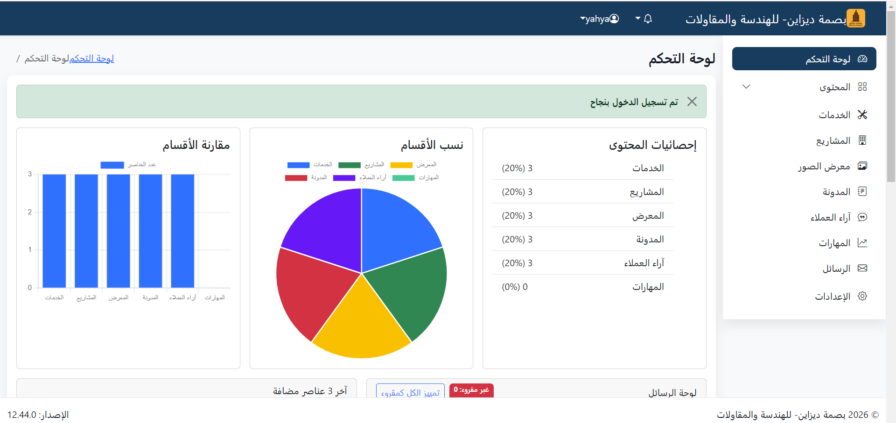
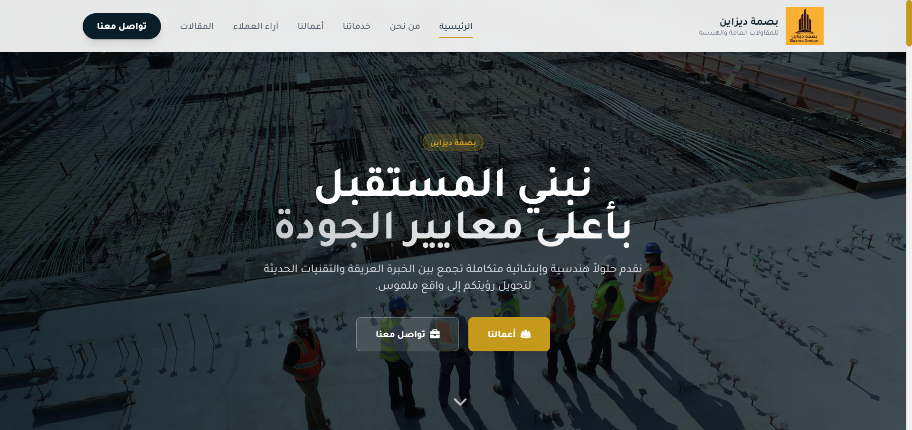
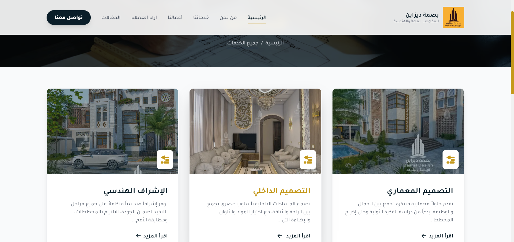

# Basma Design Full Stack Laravel CMS

## 🖼️ صور المشروع

| Dashboard                                                                       |
| ----------------------------------------------  
|  |  

| Gallery                                    | Services                                     |
| ------------------------------------------ | -------------------------------------------- |
|  |  
|  |  
مشروع إدارة محتوى (CMS) مبني باستخدام Laravel، يتيح إدارة الخدمات، المدونة، والمعرض (Gallery) من خلال لوحة تحكم متكاملة.

---

## 🚀 نظرة عامة

**Basma Design  CMS** هو نظام إدارة محتوى يساعد على تنظيم وعرض المحتوى مثل:

- 🧾 الخدمات (Services)
- 📝 المقالات / المدونة (Blog)
- 🖼️ معرض الصور (Gallery)
- 📁 المشاريع (Projects)

يحتوي على لوحة تحكم لإدارة المحتوى بشكل كامل مع دعم رفع الصور وتحسينها.

---

## ✨ المميزات

- 🔐 نظام تسجيل دخول وإدارة مستخدمين
- 🧑‍💼 لوحة تحكم Admin Dashboard
- 📤 رفع الصور مع ضغط وتحويل إلى WebP
- 🖼️ إدارة معرض الصور
- 📝 إدارة المقالات والمدونة
- 🧾 إدارة الخدمات
- ⚡ تصميم منظم وقابل للتطوير

---

## 🛠️ التقنيات المستخدمة

- Laravel 10+
- PHP 8+
- MySQL
- Intervention Image
- Blade Templates
- Bootstrap / Tailwind  

---

## 📁 هيكل المشروع
